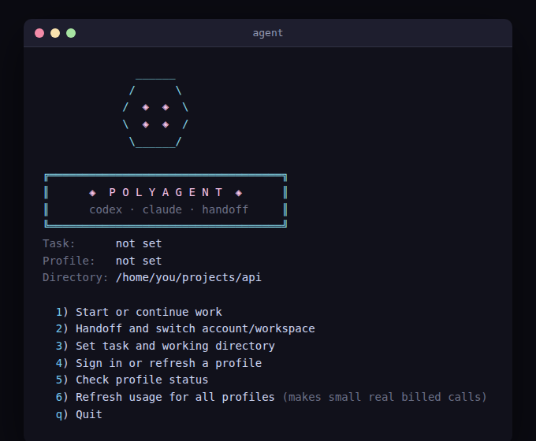

# polyagent

**Run Codex and Claude Code side by side, across as many accounts as you have, and hand work between them without losing context.**

`polyagent` is a single-file terminal launcher for people juggling multiple AI coding-agent CLIs and multiple subscriptions (personal + work). It gives every agent×account combo its own isolated identity, keeps each one alive as a real persistent session, and writes a structured handoff note every time work moves from one agent to the next — so one agent can diagnose a problem and hand it to another to implement, cleanly, on purpose.



## Highlights

- 🔀 **Switch between AI agents freely** — Codex and Claude Code, four profiles out of the box (`codex-1`, `codex-2`, `claude-1`, `claude-2`), each with its own isolated credentials. No logout/login dance to change accounts.
- 🟢 **Live sessions that survive disconnects** — every profile runs in its own `tmux` session. Detach, close the terminal, SSH in from somewhere else, reattach exactly where you left off.
- 🔁 **Automatic handoffs, with git state captured for you** — `agent switch` automatically writes a timestamped record — git root, HEAD commit, working-tree diff, your note — before attaching the next agent, so it can pick up a task another agent started, sequentially, with full context — Codex investigates, Claude implements; Claude drafts, Codex reviews; whatever order you need.
- 🧭 **One menu for everything** — `agent` opens a numbered picker showing which profiles are signed in, their last-known cost/model, and a reminder of the approval mode in effect — no subcommands to memorize.
- 💸 **Usage tracking, on your terms** — `agent usage` tracks real cost and model per signed-in profile and caches the result so the menu always shows last-known usage at a glance. It's a manual, opt-in probe — never runs, and never spends money, automatically.

## The problem

If you use both Codex and Claude Code, and you have separate personal and work subscriptions/workspaces for either or both, you end up with:

- **Credential collisions.** Both CLIs default to one config/auth directory (`~/.codex`, `~/.claude`). Logging into a second account usually means logging out of the first, or fighting with shell profiles and env vars every time you switch.
- **Lost context on handoff.** You start diagnosing something with Codex, decide Claude should implement the fix (or vice versa), and there's no clean record of what the first agent found, what the working tree looked like, or what the second agent still needs to check.
- **Session sprawl.** Long-running agent sessions in a terminal get lost the moment you close the window or disconnect, especially over SSH.
- **No visibility into which account is "hot".** With auto-approve/bypass-permission modes on (which you often want for long agent runs), it's easy to lose track of which of four accounts a given terminal is about to burn against.

None of this is hard individually. It's just enough friction that people either avoid running multiple profiles at once, or do it carelessly (shared credentials, no handoff trail, no idea what's signed in where).

## What it solves

`agent` is a single Bash script that gives each profile — `codex-1`, `codex-2`, `claude-1`, `claude-2` — its own fully isolated credential directory, then wraps starting, switching, and tracking those sessions in one interactive menu.

- **Isolated auth per profile.** Each profile gets its own `CODEX_HOME` / `CLAUDE_CONFIG_DIR`, mode `0700`. Logging into `codex-2` never touches `codex-1`'s session. No credentials are ever written to the script's own directory.
- **Persistent sessions via tmux.** `agent start <profile>` opens (or reattaches) a dedicated tmux session per `(profile, task)`. Detach with `Ctrl-b d`, come back later, even over SSH from a different machine.
- **Recorded handoffs.** `agent switch <profile> --note '...'` writes a private Markdown record — git root, HEAD commit, working-tree status, your note — before attaching the destination profile. The receiving agent is pointed at that file, so context survives the switch instead of getting lost.
- **One interactive menu, `agent`.** Start/continue work, hand off to another account, set the active task/directory, sign in, or check status — without needing to remember subcommands.
- **Deliberate, not automatic, usage checks.** Neither Codex nor Claude exposes live quota over just sitting there, and interactive sessions don't print a cost summary at exit. `agent usage` makes one small, real, billed call per signed-in profile on request and caches the result, so the profile picker can show last-known cost/model — without ever spending money automatically.
- **Auto-approve by default, on purpose.** Both CLIs launch with per-command approval prompts disabled (Codex `--ask-for-approval never --sandbox danger-full-access`, Claude `--permission-mode bypassPermissions`), because that's the point of a long-running unattended agent session. This is a real, sharp default — see [Approval mode](#approval-mode) below.

## Install

```bash
git clone https://github.com/CryptoRALLY/polyagent.git
ln -s "$(pwd)/polyagent/agent" ~/.local/bin/agent   # anywhere on your PATH works
agent init
```

Sign in once per isolated profile. In each provider's login flow, pick the account/workspace you want that profile permanently bound to:

```bash
agent login codex-1
agent login codex-2
agent login claude-1
agent login claude-2
```

Codex login uses device authentication (`codex login --device-auth`) rather than a browser localhost callback, so it also works cleanly when the terminal session is on a remote/headless machine and the browser is on your local computer.

You don't need all four profiles — only sign in to the ones you actually use. `agent status` shows which are ready.

### Adding more accounts

The default four (`codex-1`, `codex-2`, `claude-1`, `claude-2`) are just a starting point. Any name that starts with `codex-` or `claude-` works — set `AGENT_SWITCHBOARD_PROFILES` (space-separated) to add a third Codex account, drop Claude entirely, or rename profiles to whatever makes sense to you:

```bash
export AGENT_SWITCHBOARD_PROFILES="codex-1 codex-2 codex-3 claude-1 claude-2"
agent init                        # creates the new profile directory
agent login codex-3                # sign in to it
```

Put the `export` line in your shell rc file so it applies every time you run `agent`.

## Daily use

```bash
agent
```

opens the menu:

```
1) Start or continue work
2) Handoff and switch account/workspace
3) Set task and working directory
4) Sign in or refresh a profile
5) Check profile status
6) Refresh usage for all profiles (makes small real billed calls)
q) Quit
```

The same actions are available as subcommands, for scripting or SSH one-liners:

```bash
agent start codex-1 --task refactor-api --dir ~/projects/api
agent switch claude-2 --task refactor-api --note 'Codex diagnosed the root cause; implement and test the fix.'
agent status
```

Only run one agent against a given working tree at a time — the tool doesn't lock or serialize file access for you.

## How a handoff works

The core workflow this tool exists for: one agent investigates, a different agent (possibly a different provider, possibly a different account) implements — without you manually re-explaining what happened.

```bash
# 1. Codex digs into a bug
agent start codex-1 --task fix-flaky-test --dir ~/projects/api

# 2. Once it's found the cause, hand off to Claude to fix it
agent switch claude-2 --task fix-flaky-test \
  --note 'Root cause: race in the retry loop, see connection_pool.py:88. Fix + add a regression test.'
```

`switch` writes a Markdown file under the handoff directory before it attaches Claude:

```markdown
# Agent handoff: fix-flaky-test

- Created: 2026-08-18T21:04:12-07:00
- From profile: codex-1
- Working directory: `/home/you/projects/api`
- Git root: `/home/you/projects/api`
- Git HEAD: `a1b2c3d`

## Working-tree status
 M connection_pool.py

## Operator note
Root cause: race in the retry loop, see connection_pool.py:88. Fix + add a regression test.

## Required resume context
Read the shared instructions file for this project (e.g. CLAUDE.md / AGENTS.md) and any team handoff notes before acting.
```

`claude-2` starts already pointed at that file, so it opens already knowing the diagnosis, the exact commit, and what's left to do — instead of starting cold. Chain as many of these as you want: Codex → Claude → Codex again, across however many accounts you've got signed in.

## Usage/cost visibility

```bash
agent usage
```

makes one small, real, billed call to each signed-in profile (a trivial "reply with exactly: ok" prompt) to read back the model and cost the provider reports, and caches it. Claude reports exact USD cost; Codex/ChatGPT-plan profiles currently only expose token counts, not a dollar figure. This never runs automatically — you have to ask for it, every time, the same way the tool never picks an account for you automatically.

## Approval mode

By default, sessions launch with no per-command confirmation:

- Codex: `--ask-for-approval never --sandbox danger-full-access`
- Claude: `--permission-mode bypassPermissions`

This means an active `agent` session has your full shell-level authority — the agent can run any command, edit any file it can reach, without asking first. That's the tradeoff for a long-running, hands-off agent session; it is **not** a safe default for untrusted prompts or untrusted repos. If you want per-command approval, edit `run_profile()` in the script and drop those flags for the profiles where you want it.

## Configuration

All optional:

| Variable | Default | Purpose |
|---|---|---|
| `AGENT_SWITCHBOARD_HOME` | `~/.local/share/agent-switchboard` | Where profile credentials, session state, and cached usage data live. |
| `AGENT_SWITCHBOARD_PROFILES` | `codex-1 codex-2 claude-1 claude-2` | Space-separated list of profile names. Any name starting with `codex-` or `claude-` works — see [Adding more accounts](#adding-more-accounts). |
| `AGENT_SWITCHBOARD_HANDOFF_HOME` | `$AGENT_SWITCHBOARD_HOME/handoffs` | Where handoff Markdown records are written. Point this at a shared/synced directory if multiple machines or agents should see the same handoff trail. |
| `AGENT_SWITCHBOARD_RESUME_NOTE` | a generic reminder to read your project's shared instructions file | Free-text note appended to every handoff record, e.g. project-specific rules of engagement. |

## Requirements

- `bash`, `tmux`, `python3` (used only to parse the small JSON usage responses)
- [Codex CLI](https://github.com/openai/codex) and/or [Claude Code](https://github.com/anthropics/claude-code), whichever profiles you actually use

## Roadmap

- **Task-fit agent recommendation.** A short survey of the task at hand (math/logic-heavy, large refactor, greenfield codegen, exploratory research, etc.) that recommends which signed-in profile/model is the better fit before you commit to one — e.g. steering toward the model that tends to do best at math over one that's stronger at broad refactors — instead of always defaulting to whichever profile is top of mind.

## License

MIT — see [LICENSE](LICENSE).
